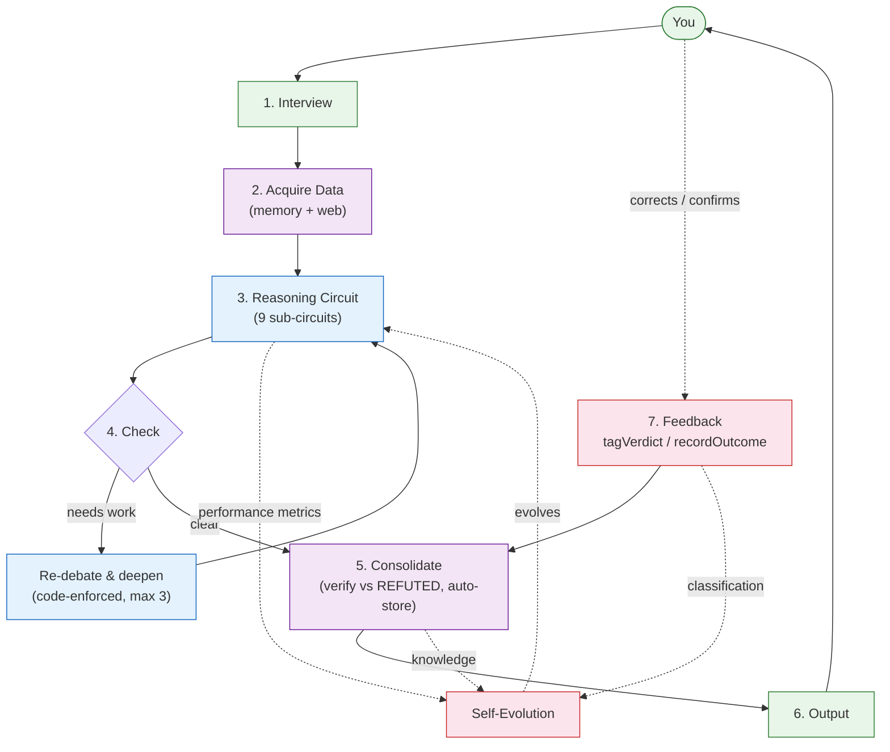

<p align="center">
  
  
</p>

<h1 align="center">🧠 Ponder</h1>

<p align="center">
  <b>A cognitive circuit for Claude Code.<br>
  Interact → Reason → Verify → Evolve.</b>
</p>

<p align="center">
  <a href="README_CN.md">🇨🇳 中文</a>
  &nbsp;&nbsp;|&nbsp;&nbsp;
  <code>/luke:ponder &lt;your question&gt;</code>
</p>

---

## How it works

Most LLM tools answer immediately — and miss the mark. Ponder activates a complete thinking circuit before answering.

```
1. Interview  → finds what you actually need
2. Gather     → local memory first, web second
3. Reason     → 9 cognitive circuits, sub-agent enforced
4. Debate     → optimist · pessimist · contrarian
5. Verify     → independent agent tries to disprove
6. Output     → clear, data-backed conclusion
7. Evolve     → learns from every session
```

Every circuit is code-enforced where it matters: data acquisition, verification, knowledge storage, self-evolution. None can be skipped.

---

## Cognitive Architecture



> Self-Evolution collects data from every circuit — reasoning performance, knowledge quality, user corrections. Between sessions, the circuit adjusts weights, order, and sub-circuit selection. Statistics-driven, not LLM-driven.

---

## Core capabilities

| Layer | What | How |
|-------|------|-----|
| **Reasoning** | 9 sub-circuits | Divergence → Dimension check → Free association → Scenario simulation (with MCTS) → Multi-stance debate → Convergence + self-check → Prediction check → Independent verification → Action proposal. Sub-agent enforced, cannot skip. |
| **Memory** | 3 timescales | Triple Burner (sec~min) → Session Context (min~hours) → MMA Meridian (days~months). Emotion-gated, sleep-consolidated, tag-indexed (O(1) recall). |
| **Data** | Unified entry | `acquire(tags)` → check local memory → web search fallback → store as HYPOTHESIS → exclude REFUTED on recall. Every sub-circuit uses this path. |
| **Debate** | Evidence-based | Optimist · Pessimist · Contrarian — each searches memory independently, presents evidence with credibility status (CONFIRMED / PROVISIONAL / HYPOTHESIS). |
| **Depth loop** | Code-enforced | After verification, auto-checks: self-check passed? issues minimal? prediction error low? If any fails → re-debate with more data (max 3 rounds). |
| **Self-evolution** | Statistics-driven | `free_energy = verify_fail×0.4 + check_fail×0.3 + pred_error×0.3`. > 0.4? → data-driven mutation (weight/order/sub-circuits). Next session uses evolved config. |
| **User feedback** | Mandatory | User corrects → `tagVerdict(id, 'refuted')` → knowledge classified REFUTED → excluded from future recall. Propagation to linked knowledge. |
| **Language** | Auto-detect | Detects user language (zh/en/ja/ko/...) and domain (finance/tech/strategy/...). Translates all internal operations — no hardcoded mappings. |
| **Philosophy** | 4 principles | Wu Wei (don't force), Cook Ding's Ox (find natural gaps), Zhong Yong (dynamic balance), Clinging Nowhere (don't cling to methods). |
| **MCTS** | Integrated | Tree search built into simulation sub-circuit: `tree init → select → simulate → backprop`. Also available as standalone CLI. |

---

## Install & use

```bash
# One-time install
/plugin marketplace add https://github.com/ljjluke/ponder-skill
/plugin install luke

# Then:
/luke:ponder <your question>
```

Data stays local: `~/.claude/data/skills/ponder/`

---

## Theoretical roots

Free Energy Principle · HyperNEAT · TD Learning · Active Inference · 易经 · 荀子 · 庄子 · 王阳明

---

<p align="center">
  <i>不是使用的工具，而是训练的大脑。</i><br>
  <sub>Not a tool you use. A brain you raise.</sub>
</p>
