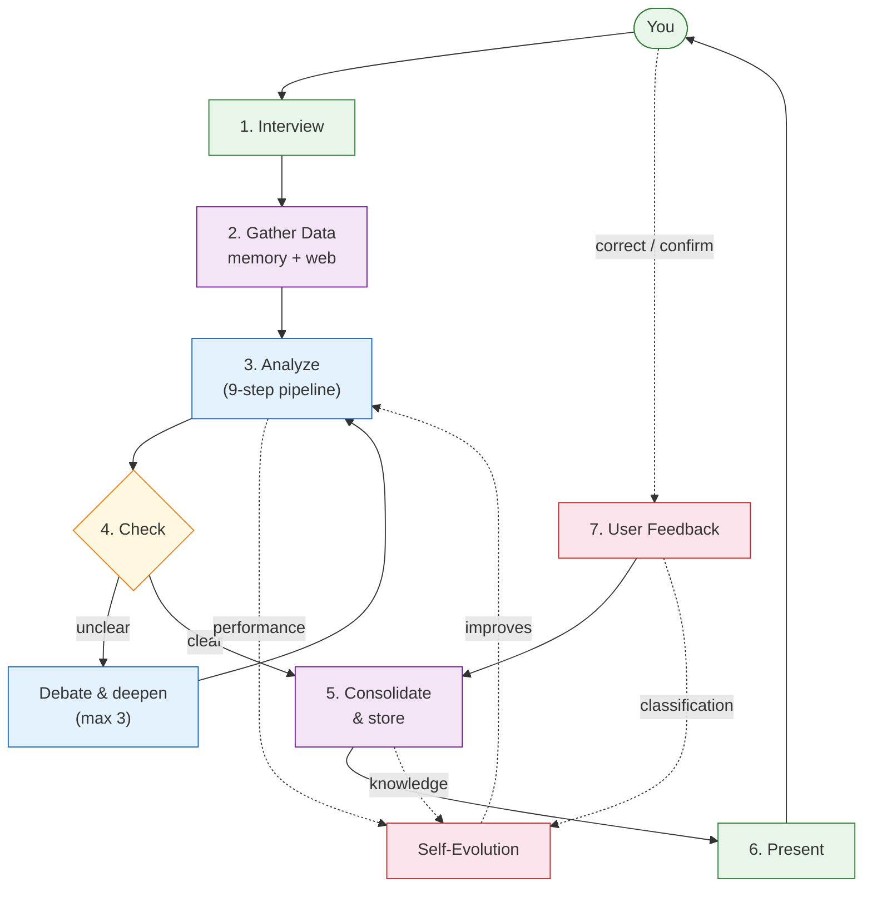

<p align="center">
  
  
</p>

<h1 align="center">🧠 Ponder</h1>

<p align="center">
  <a href="README_CN.md">🇨🇳 中文</a>
</p>

<p align="center">
  <b>Ask once. Get an answer that's been stress-tested from every angle.</b><br>
  <i>Then watch your pipeline get smarter — because it learns from every question.</i>
</p>

---

Most LLM tools answer immediately — and get it wrong the first time. Ponder doesn't answer until it's **stress-tested from every angle**:

1. 🔍 **Interviews you** — finds the real question underneath
2. 👁️ **6 perspectives × 8 dimensions** — no blind spots
3. 📡 **Real data, not guesses** — memory first, web second
4. 🎲 **Parallel scenario simulation** — each backed by live research
5. ⚖️ **Self-debate** — optimist vs pessimist vs contrarian, then rebuts
6. 🛡️ **Adversarial verification** — independent agent tries to prove you wrong
7. 🧠 **Learns from every use** — pipeline evolves, mistakes remembered

```
/luke:ponder <your question>
```

---

## Architecture



> **Self-Evolution** collects data from every phase: step performance, knowledge quality, user corrections. Between sessions, the pipeline adjusts based on this data — weights, order, even which steps exist.

### Pipeline (9 phases, sub-agent enforced)

| Phase | What it does | Brain analog |
|-------|-------------|-------------|
| 6-perspective divergence | Observe from system/micro/short/long/flow/selfless | DMN |
| Bagua Mirror 8-dim | Force/foundation/change/penetration/risk/dependency/boundary/balance | PFC |
| DMN incubation | Free association between structured phases | DMN rest |
| Multi-scenario simulation | Parallel agents, each with real WebSearch data | Motor cortex |
| Social debate | Optimist/pessimist/contrarian argue → rebut → revise | TPJ |
| Convergence + self-check | Somatic-marker weighted + 5 questions | Anterior cingulate |
| Hierarchical prediction | Top-down prediction error | Neocortex L6→L2 |
| Independent verification | Fresh context, adversarial audit | PFC error monitor |
| Action proposal | Concrete action + expected outcome | Motor-sensory loop |

### Three Memory Layers

| Layer | Timescale | Function |
|-------|-----------|----------|
| Triple Burner | sec~min | Working memory (7±2 chunks) |
| Session Context | min~hours | Cross-analysis accumulation |
| MMA Meridian | day~month | Permanent knowledge (12 meridians) |

MMA stores knowledge as acupoints: emotion-gated consolidation, source reliability tracking, NREM→REM sleep cycles, O(1) tag-indexed retrieval.

### Self-Evolution

```
free_energy = verify_fail×0.4 + self_check_fail×0.3 + prediction_error×0.3
> 0.4? → recommend-mutation (from historical stats)
       → weight_adjust / disable_step / change_order / insert_step / parallelize
       → MMA remembers for next round
```

No LLM decides what to change — statistics do. All local, no data upload.

### Language Adaptation Layer

The framework detects the user's language (Chinese/English) and domain (finance/tech/strategy/health/general), and translates all internal operations into user-friendly terms:

| Internal operation | Chinese user sees | English user sees |
|-------------------|-------------------|-------------------|
| memory recall | 记忆提取中... | Recalling memory... |
| web search | 正在获取信息... | Gathering information... |
| pipeline | 分析进行中... | Analysis in progress... |
| diverge (finance) | 多角度市场扫描 | Market multi-angle scan |
| diverge (tech) | 技术方案对比 | Technical solution comparison |
| bagua (finance) | 多维度风险评估 | Multi-dimensional risk assessment |
| bagua (tech) | 技术架构审查 | Technical architecture review |

### Abstract Decision Principles (Chinese Philosophy)

The framework's decisions are governed by four principles — not features, but a "way of thinking":

| Principle | Application |
|-----------|------------|
| Wu Wei (无为) | Don't force — feel information density before deciding to deepen |
| Cook Ding's Ox (庖丁解牛) | Cut at the natural gaps — don't force all dimensions equally |
| Zhong Yong (中庸) | Dynamic balance — depth loop stops by info gain, not fixed rounds |
| Clinging Nowhere (应无所住) | Don't cling to methods — if a step doesn't fit, replace it |

### Adaptive Depth Loop

When the pipeline returns an uncertain result, it automatically deepens:
- Round 1 uncertain → deepen naturally
- Round 2+ → assess information gain; continue if positive, stop if saturated
- Max 3 rounds; if still uncertain, honestly lists data gaps

No vague conclusions. Every claim must have data support.

---

## Install

```bash
/plugin marketplace add https://github.com/ljjluke/mcts-skill
/plugin install luke
```

Then: `/luke:ponder <your question>`

> Data location: `~/.claude/data/skills/mcts-td-planner/` — physically separate from skill code. Safe across upgrades.

---

## MCTS-TD CLI (available but separate)

The original MCTS-TD algorithms remain in the codebase as standalone CLI commands:

```bash
node scripts/mcts.js tree init --solutions '[...]'   # MCTS tree search
node scripts/mcts.js compute ucb --v 0.5 --n 3       # UCB calculation
node scripts/mcts.js mma reinforce <id> <td_error>    # TD learning update
```

These are not part of the main pipeline but are available for direct use or integration. The pipeline uses the structured thinking approach (9 phases), while MCTS-TD provides lower-level decision search for users who need it.

---

## Project Stats

| Metric | Value |
|--------|-------|
| JavaScript files | 17 scripts + 13 MMA modules |
| CLI commands | 50+ across 8 engines |
| Theoretical foundations | Free Energy Principle / HyperNEAT / TD Learning / Active Inference / 易经 / 荀子 / 庄子 / 王阳明 |

---

<p align="center">
  <i>Not a tool you use. A brain you raise.</i>
</p>
