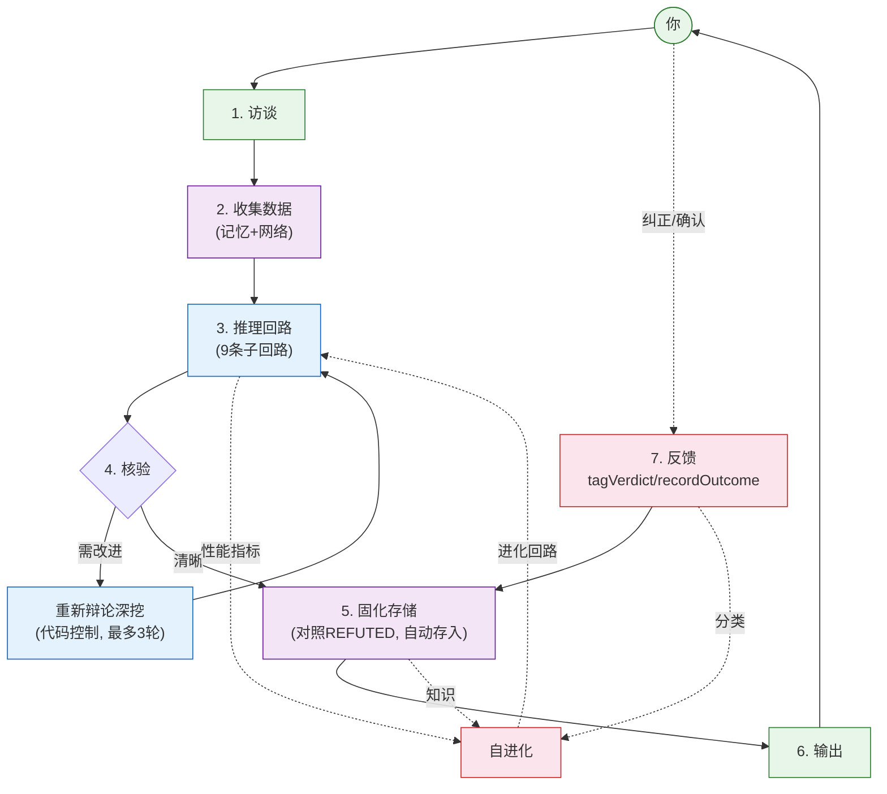

<p align="center">
  
  
</p>

<h1 align="center">🧠 Ponder</h1>

<p align="center">
  <b>Claude Code 的认知回路。<br>
  交互 → 推理 → 核验 → 进化。</b>
</p>

<p align="center">
  <a href="README.md">🌐 English</a>
  &nbsp;&nbsp;|&nbsp;&nbsp;
  <code>/luke:ponder &lt;你的问题&gt;</code>
</p>

---

## 工作方式

大多数 LLM 工具会立即回答——但经常答偏。Ponder 会在回答前激活完整的思考回路。

```
1. 访谈   → 找到真实需求
2. 收集   → 本地记忆优先, 网络次之
3. 推理   → 9条认知回路, 子Agent强制执行
4. 辩论   → 乐观 · 悲观 · 异见三方
5. 核验   → 独立Agent试图证伪
6. 输出   → 清晰、有数据支撑的结论
7. 进化   → 每次使用都在进步
```

关键回路由代码强制：数据采集、核验、知识存储、自进化。不可跳过。

---

## 认知架构



> 自进化从所有回路采集数据——推理性能、知识质量、用户纠正。会话之间回路自动调整权重、顺序和子回路选择。由统计数据驱动，非LLM驱动。

---

## 核心能力

| 层级 | 说明 | 细节 |
|------|------|------|
| **推理** | 9条子回路 | 发散 → 维度检查 → 自由联想 → 场景推演(含MCTS) → 多方辩论 → 综合判断+自检 → 预测核验 → 独立验证 → 行动建议。子Agent强制, 不可跳过。 |
| **记忆** | 三层时间尺度 | 三焦(秒~分) → 会话(分~时) → MMA经脉(天~月)。情绪门控、睡眠巩固、标签索引(O(1)召回)。 |
| **数据** | 统一入口 | `acquire(标签)` → 查本地记忆 → 网络搜索补充 → 存为HYPOTHESIS → 召回时排除REFUTED。所有子回路走同一路径。 |
| **辩论** | 证据驱动 | 乐观·悲观·异见——各自独立搜索记忆, 证据带可信度状态(CONFIRMED/PROVISIONAL/HYPOTHESIS)呈现。 |
| **深度循环** | 代码控制 | 核验后自动检测：自检通过? 问题数少? 预测误差低? 任一不满足→重新辩论深挖(最多3轮)。 |
| **自进化** | 统计驱动 | 自由能=验证失败×0.4+自检失败×0.3+预测误差×0.3。>0.4?→数据驱动变异(权重/顺序/子回路)。下次使用进化配置。 |
| **用户反馈** | 强制 | 用户纠正→tagVerdict(标记错误)→知识归类REFUTED→未来召回排除。自动传播到关联知识。 |
| **语言** | 自动适配 | 检测用户语言(中/英/日/韩...)和领域(金融/技术/战略...)。内部操作全翻译——无硬编码映射。 |
| **哲学** | 四条原则 | 无为(不强行)、庖丁解牛(找天然间隙)、中庸(动态平衡)、应无所住(不执著于方法)。 |
| **MCTS** | 集成 | 树搜索嵌入推演子回路: init→select→simulate→backprop。也提供独立CLI。 |

---

## 安装使用

```bash
# 一次性安装
/plugin marketplace add https://github.com/ljjluke/ponder-skill
/plugin install luke

# 使用
/luke:ponder <你的问题>
```

数据本地存储：`~/.claude/data/skills/ponder/`

---

## 理论基础

自由能原理 · HyperNEAT · TD学习 · 主动推理 · 易经 · 荀子 · 庄子 · 王阳明

---

<p align="center">
  <i>不是使用的工具，而是训练的大脑。</i>
</p>
