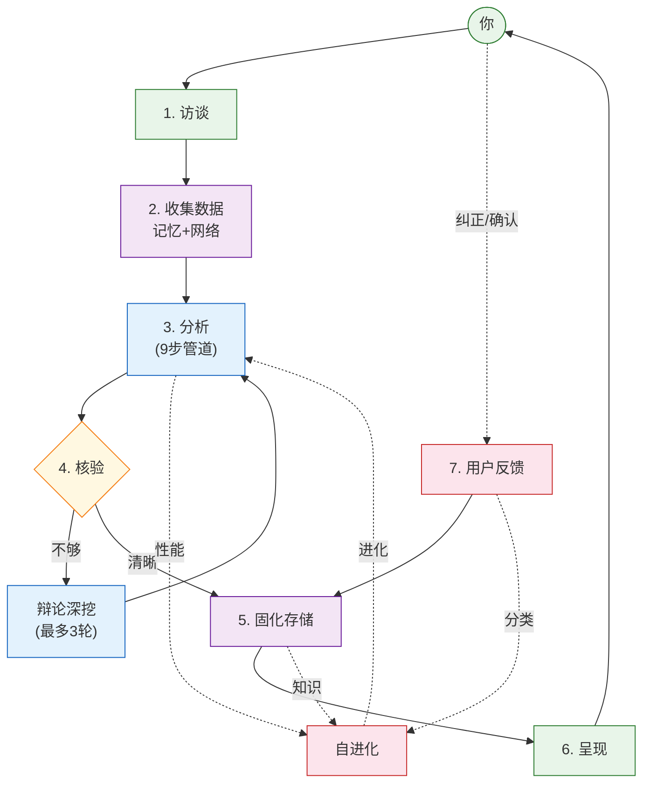

<p align="center">
  
  
</p>

<h1 align="center">🧠 Ponder</h1>

<p align="center">
  <b>本地训练认知管道 · 适用于 Claude Code</b><br>
  <sub>访谈 → 发散 → 推演 → 辩论 → 验证 → 进化</sub>
</p>

---

大多数 LLM 工具会立即回答——然后答错。Ponder 不会在**全方位压力测试**之前给出答案：

1. 🔍 **先访谈你** — 找到真实需求
2. 👁️ **6视角×8维度** — 没有盲区
3. 📡 **真实数据** — 记忆优先, 网络次之
4. 🎲 **并行推演** — 每个场景基于实时搜索
5. ⚖️ **自我辩论** — 乐观·悲观·异见三方
6. 🛡️ **对抗式验证** — 独立Agent试图证伪
7. 🧠 **每次使用都学习** — 管道进化, 错误被记住

```
/luke:ponder <你的问题>
```

---

## 架构


flowchart TB
    subgraph SE["自进化（从所有阶段采集数据）"]
        direction LR
        SE_IN["访谈模式<br/>步骤表现<br/>错误率<br/>用户纠正"] --> SE_OUT["数据驱动变异<br/>下次生效"]
    end

    A["1. 访谈"] --> B["2. 分析"]
    B --> C{"3. 核验"}
    C -->|不够| D["4. 辩论深挖"]
    D --> B
    C -->|够| E["5. 呈现"]
    E --> F["6. 用户反馈"]

    A -.->|数据| SE_IN
    B -.->|数据| SE_IN
    C -.->|数据| SE_IN
    D -.->|数据| SE_IN
    F -.->|数据| SE_IN
    SE_OUT -.->|下次用| B
```

---

## 核心亮点

### 9步管道（子Agent强制执行）

| 阶段 | 功能 | 脑区类比 |
|------|------|---------|
| 6视角发散 | 系统/微观/短期/长期/自然/无立场 | DMN |
| 八卦镜8维 | 动力/根基/扰动/渗透/风险/表象/边界/平衡 | 前额叶 |
| DMN间歇 | 结构化阶段间的自由联想 | DMN静息 |
| 多场景推演 | 并行子Agent，各自基于真实WebSearch数据 | 运动皮层 |
| 社会辩论 | 乐观·悲观·异见三方→反驳→修正 | 社会认知 |
| 收敛+自检 | 躯体标记加权+5问 | 前扣带回 |
| 层级预测 | 自上而下的预测误差 | 新皮层 |
| 独立验证 | 全新上下文，对抗式审计 | 错误监控 |
| 行动建议 | 具体行动+预期结果 | 运动-感知 |

### 三层记忆

| 层级 | 时间尺度 | 功能 |
|------|---------|------|
| 三焦工作记忆 | 秒~分 | 即时缓存(7±2块) |
| 会话上下文 | 分~时 | 跨分析积累 |
| MMA经脉记忆 | 天~月 | 永久知识(12正经+8奇经) |

情绪门控巩固、来源可靠性追踪、NREM→REM睡眠周期、标签索引O(1)查找。

### 自进化

```
自由能 = 验证失败×0.4 + 自检失败×0.3 + 预测误差×0.3
> 0.4? → recommend-mutation(基于历史统计)
       → weight_adjust / disable_step / change_order / insert_step / parallelize
       → MMA记录→下次参考
```

LLM不决定进化方向——统计数据决定。全部本地运行。

### 语言适配层

自动检测用户语言（中文/英文）和领域（金融/技术/战略/医疗），将内部操作翻译为友好描述：

| 内部操作 | 中文用户看到 | 英文用户看到 |
|---------|-------------|-------------|
| memory recall | 记忆提取中... | Recalling memory... |
| web search | 正在获取信息... | Gathering information... |
| pipeline | 分析进行中... | Analysis in progress... |
| diverge(金融) | 多角度市场扫描 | Market multi-angle scan |
| diverge(技术) | 技术方案对比 | Technical solution comparison |
| bagua(金融) | 多维度风险评估 | Multi-dimension risk assessment |

### 中国哲学决策原则

框架的所有技术决策遵循四条原则：

| 原则 | 应用 |
|------|------|
| 无为 | 感受信息密度再做反应，不强行深挖 |
| 庖丁解牛 | 找问题天然间隙切入，不强行填模板 |
| 中庸 | 深度终止由信息增益决定，不预设轮数 |
| 应无所住 | 不执著于方法，不适合的步骤直接换掉 |

### 自适应深度循环

结果不确定时自动深挖：
- 第一轮不确定→正常深挖
- 第二轮后→评估信息增益，正向继续，饱和停止
- 最多3轮，仍不确定则诚实告知数据缺口

没有模棱两可的结论。每个判断必须有数据支撑。

---

## 安装

```bash
/plugin marketplace add https://github.com/ljjluke/mcts-skill
/plugin install luke
```

然后输入：`/luke:ponder <你的问题>`

> 记忆数据：`~/.claude/data/skills/mcts-td-planner/` — 与技能代码物理隔离，升级不丢失。

---

## MCTS-TD CLI（可选，独立于管道）

原始的 MCTS-TD 算法保留在代码中，作为独立的 CLI 命令使用：

```bash
node scripts/mcts.js tree init --solutions '[...]'   # MCTS树搜索
node scripts/mcts.js compute ucb --v 0.5 --n 3       # UCB计算
node scripts/mcts.js mma reinforce <id> <td_error>    # TD学习更新
```

这些不参与主管道流程，但保留给需要直接使用低层决策搜索的用户。

---

## 理论基础

| 思想 | 应用 |
|------|------|
| Friston 自由能原理 | 自由能驱动拓扑变异 |
| HyperNEAT 拓扑进化 | weight_adjust / insert_step / parallelize |
| TD学习 + Welford | 值更新、置信度追踪 |
| 易经 | 变易/不易——变与不变的元规则 |
| 荀子 | 逐步积累（会话上下文） |
| 王阳明 | 知行合一（分析与行动一体） |
| 庄子 | 多视角自由发散（逍遥游） |

---

<p align="center">
  <i>不是使用的工具，而是训练的大脑。</i>
</p>
