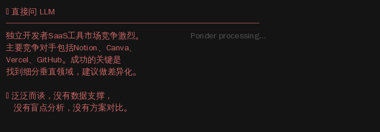

<p align="center">
  
  
  
</p>

<h1 align="center">🧠 Ponder</h1>

<p align="center">
  <b>让 AI 先想清楚，再开口。</b><br>
  <i>代码强制的推理管线 · 越用越准 · 跨领域通用</i>
</p>

<p align="center">
  <a href="README.md">🌐 English</a>
  &nbsp;·&nbsp;
  <code>/luke:ponder &lt;你的问题&gt;</code>
</p>

<br>

---

## ✨ 每次用 AI，你都在赌。

赌它这次答得对。赌它不会漏掉关键信息。赌它不会跟上次一样自信满满地说一个错误答案。

**问题不在模型，在想的过程。**

大多数 LLM 有问必答。Ponder 不——它把每个问题跑完 9 道工序：需求打磨 → 神思破框 → 多视角扫描 → 盲点发现 → 方案生成 → 8 维评分 → 推演 → 辩论攻防 → 用户确认。每道工序有独立的检查、代码质量门禁、和存储机制。

结果不是"答得更快"，是**"答得更可信"**。

而且每一次回答，都在让自己变强——因为每次分析的结论都会积累到记忆系统里。系统记得什么对了、什么错了、你纠正过什么。下一次直接用。

---

### 一眼看清

```
你提问
    ↓
┌───────────────────────────────────────────┐
│      采访（五诊画像：天/地/人/法/物）        │
├───────────────────────────────────────────┤
│   神思破框  ──→  6视角发散                 │
│      ↓                ↓                   │
│   八卦镜找盲点 →  5-10个方案               │
│      ↓                ↓                   │
│   8维评分      →  推演 + 辩论              │
│      ↓                ↓                   │
│       用户确认 →  最终结论                  │
└───────────────────────────────────────────┘
    ↓
每步代码检查，每步产出积累。下一次更准。
```

<br>

### 看对比



*左侧: 直接问 LLM。右侧: 同一问题通过 Ponder 9 道管线。*

```

你提问 → 需求打磨 → 神思破框 → 多视角发散 → 盲点发现
       → 方案生成 → 8维评分 → 收敛 → 推演 → 辩论攻防
       → 用户确认 → 最终结论

每次分析的结果自动积累到记忆系统。下一次比上一次更准。
```

### 核心亮点

| 能力 | 为什么重要 |
|---|---|
| 🎯 **需求打磨** | 第一步不是分析，是确保你在解决对的问题。带选项的追问，直到画像清晰。 |
| 🌪️ **神思破框** | 不是"换个角度想想"。五步认知工序（虚静→神凝→神游→意象→言意），产出真正的反直觉发现。 |
| 👁️ **八卦镜找盲点** | 8个维度 × 独立 agent 同步扫描，找出你没意识到的盲区和隐藏假设。 |
| 📊 **8维方案评分** | 每个方案在可行性、应变力、穿透力、风险等8个维度由独立 agent 打分，不做单一维度评价。 |
| ⚔️ **辩论攻防** | 方案不是被比较——是被攻击。每个方案承受其他所有方案的联合批判，活下来的才是真强者。 |
| 🧠 **记忆永不丢** | 每次分析产出自动存入 MMA。下次同类问题，系统自动调取 top 3 最相关的历史经验做参考。 |
| 🔄 **自我进化** | 权重注册表根据实际结果自动调整系数。知识有生命周期——新生→验证→确认→沉睡→归档。 |
| 🎯 **用户确认** | 不硬推结论。出推荐方案后检查遗留盲点和假设，让用户确认"这些风险你接受吗？"后再出最终结论。 |

---

## 🏗 架构一览

```
┌──────────────────────────────────────────────────────────────────┐
│                        编排器 (SKILL.md)                          │
│  唯一的编排者。没有管道引擎、没有 workflow、没有调度层。           │
│  LLM 读到 SKILL.md → 按顺序执行各阶段 → 完成。                   │
├──────────────────────────────────────────────────────────────────┤
│                                                                   │
│  ┌─ 需求打磨 ────────────────────────────────────────────────┐   │
│  │  AskUserQuestion 一次一问 → 天时/地利/人和/法/本质          │   │
│  └───────────────────────────────────────────────────────────┘   │
│                              │                                    │
│                              ▼                                    │
│  ┌─ 分析序列 ───────────────────────────────────────────────┐   │
│  │                                                           │   │
│  │  神思 (破框)      → 主线程，五步认知工序                │   │
│  │  发散 (6视角)     → 主线程，多角度审视                  │   │
│  │  八卦镜 (盲点)    → 8 agent × 1 维度                    │   │
│  │  方案 (生成)      → N agent × 1 方案                    │   │
│  │  方案评分 (8维)   → N agent × 8 维度评分                │   │
│  │  收敛 (淘汰)      → 主线程，依评分保留最优              │   │
│  │  推演 (模拟)      → N agent × mcts-simulator            │   │
│  │  辩论 (攻防)      → 立论 + 围攻 + 抗压排名              │   │
│  │  用户确认         → LLM推荐 + 检查遗留盲点              │   │
│  │  综合结论         → 完整结论+风险+建议                   │   │
│  │                                                           │   │
│  │  每步: 查top3历史 → 读prompt JSON → 读引擎文档            │   │
│  │       → 执行 → 展示 → 存产出                              │   │
│  └───────────────────────────────────────────────────────────┘   │
│                              │                                    │
│                              ▼                                    │
│  ┌─ MMA 记忆系统 ────────────────────────────────────────────┐   │
│  │  12条正经 × 知识点                                       │   │
│  │  语义匹配(中/英/日/韩) · 自然语言存储                     │   │
│  │  知识保洁: 衰减/促进/沉睡/归档                            │   │
│  │  情绪调制 · 再巩固窗口(30分钟)                            │   │
│  │  写前日志 + 分片锁 + 原子写入                             │   │
│  └───────────────────────────────────────────────────────────┘   │
│                              │                                    │
│                              ▼                                    │
│  ┌─ 辅助工具 (按需调用) ────────────────────────────────────┐   │
│  │  orchestrate.js — 存产出、查历史、收尾                    │   │
│  │  mcts_compute.js — 数学引擎(80+命令)                     │   │
│  │  mcts_guard.js   — 合规守卫                              │   │
│  │  evolve.js       — 离线进化分析                           │   │
│  └───────────────────────────────────────────────────────────┘   │
└──────────────────────────────────────────────────────────────────┘
```

---

## 💡 核心理念

**大多数糟糕决策来自盲点，而不是推理能力不足。**

Ponder 不是在"更努力地思考"——它是在从不同位置思考。每个阶段改变观察者的立脚点：

- **神思** 改变你的精神状态（清空 → 凝聚 → 漫游 → 浮现 → 连接）
- **发散** 改变你的观察尺度（宏观 → 微观 → 时间压缩 → 时间扩展 → 无我）
- **八卦镜** 改变你的评估维度（驱动力 → 基础 → 变化 → 风险 → 边界 → 平衡）
- **方案评分** 改变你的评价标准（可行性 → 应变力 → 穿透力 → 价值）
- **辩论** 改变你的立场（辩护 → 攻击 → 幸存）

一轮分析下来，你已经从 20+ 个不同角度审视过问题。能从这个密度下逃掉的盲点，很少。

---

## 🔄 记忆怎么工作

```
每步执行完 → orchestrate.js step 存产出到 MMA
  （自然语言，不是 JSON → 语义匹配可用）

下次同类问题 → node scripts/orchestrate.js history <阶段> <类型>
  → 返回 top 3 最相关的历史记录
  → 注入当前阶段的 prompt 作为参考

旧数据衰减 → 未用知识沉睡 → 低质归档 → 高频自动升级
```

---

## 🚀 快速开始

```bash
# 安装
/plugin marketplace add https://github.com/ljjluke/ponder-skill
/plugin install luke

# 使用——任何领域
/luke:ponder 帮我分析一下A股
/luke:ponder 规划一下Python学习路线
/luke:ponder 分析这个创业项目的竞争格局
/luke:ponder 比较三种营销策略的优劣
/luke:ponder 帮我评估两种治疗方案
/luke:ponder 分析这个农业项目的可行性
```

### 自定义存储目录

```bash
# Linux / macOS
export PONDER_DATA_DIR=/mnt/nas/my-knowledge
PONDER_DATA_DIR=/mnt/nas/my-knowledge claude

# Windows (PowerShell)
$env:PONDER_DATA_DIR = "D:\my-knowledge"
claude
```

默认: `~/.claude/data/skills/ponder/`

---

## 📁 项目结构

```
ponder-skill/
├── SKILL.md                        # 唯一编排器——无管道、无workflow
├── agents/                         # 子agent定义（一个文件一个角色）
│   ├── dimension-evaluator.md      # 维度盲点发现
│   ├── solution-generator.md       # 独立方案生成
│   ├── debater.md                  # 方案辩护
│   └── mcts-simulator.md           # 情景模拟推演
├── engine/                         # 思考框架文档（每阶段一个）
│   ├── shensi.md / divergence.md / bagua.md
│   ├── converge.md / debate.md / synthesis.md
│   └── mcts-constraint.md / mcts-predictive.md / td-learner.md
├── scripts/
│   ├── orchestrate.js             # 存产出、查历史、收尾
│   ├── mcts_compute.js            # 数学引擎（80+命令）
│   ├── mcts_guard.js              # 合规守卫（15个检查器）
│   ├── mcts_tree.js               # 树数据结构（可选）
│   ├── knowledge.js               # MMA记忆接口
│   ├── prompts/                   # 阶段prompt模板 + schema
│   │   ├── shensi.json / divergence.json / bagua.json
│   │   ├── plans.json / simulate.json / converge.json
│   │   ├── debate.json / synthesis.json
│   └── mma/                       # MMA记忆算法（12模块）
│       ├── io.js / deqi.js / ashi.js / reinforce.js / decay.js
│       ├── constants.js / state_machine.js / ziwu.js
│       ├── diagnosis.js / cluster.js / audit.js / user_profile.js
├── hooks/hooks.json               # 会话生命周期
└── pipeline-meta.json             # 进化元数据
```

---

## 🧘 设计哲学

| 原则 | 含义 |
|------|------|
| **无隐藏编排** | SKILL.md 是唯一的编排者。你读到什么，LLM 就执行什么。 |
| **仅在必要时隔离** | 子 agent 只用于真正需要并行和隔离的工作（多维评分、方案生成、模拟推演）。其余全在主线程执行。 |
| **代码结构，非代码强制** | prompt 做引导，schema 做约束，agent 做专业化。没有 workflow 引擎。 |
| **跨领域设计** | 所有维度和框架使用领域中性语言。不假设用户是搞技术、金融还是医疗。 |
| **记忆是一等公民** | 每次产出自持存储。每次运行丰富下次。知识有生命周期：HYPOTHESIS → CONFIRMED → SLEEPING → ARCHIVED。 |
| **输出为人类阅读** | 不出 JSON、不出路径、不出框架术语。表格用于对比，段落用于叙事。 |

---

<p align="center">
  <sub>Claude Code 认知框架 · 用 ❤️ 构建 · 不是提示词，是一个大脑</sub>
</p>
